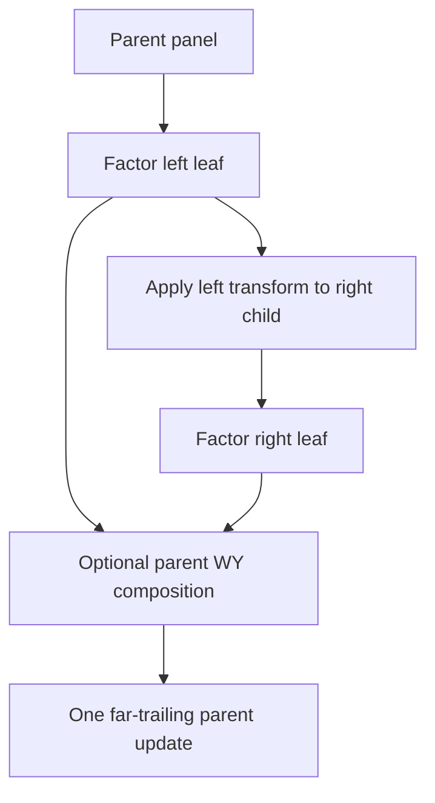
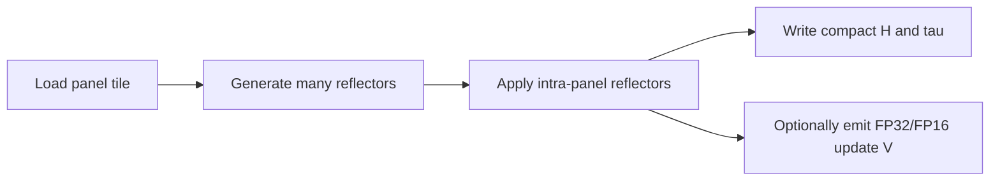
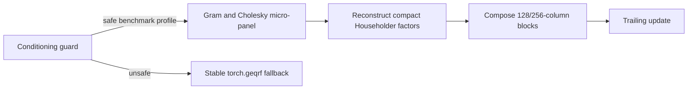

# Algorithm and Terminology

This implementation combines four ideas whose boundaries matter:

1. blocked Householder QR and compact WY;
2. recursive Householder panel decomposition;
3. fused **panel** megakernels;
4. a guarded Gram/CholeskyQR-style specialization for the n4096 benchmark.

CUDA Graph replay is an execution mechanism around those algorithms, not a
fifth QR algorithm and not a form of kernel fusion.

## 1. Blocked Householder QR

For column `i`, a Householder reflector is

```math
H_i = I - \tau_i v_i v_i^T.
```

Factoring a panel of width `b` produces `b` reflectors. Compact WY represents
their product as

```math
Q_p = H_0 H_1 \cdots H_{b-1} = I - V T V^T,
```

where `V = [v_0, ..., v_{b-1}]` and `T` is a small triangular factor. A
blocked QR applies that transform to the trailing matrix with level-3 matrix
operations.


Blocking does not remove the dependency between reflectors inside the panel:
reflector `i + 1` needs the panel state updated by reflector `i`. A wider panel
creates fewer, larger trailing updates, but lengthens that serial chain and
increases register/shared-memory pressure.

In this repository, “flat blocked Householder” means that one leaf kernel
factors all `b` columns before the external compact-WY update.

## 2. Recursive Householder panels

For a panel split as `b = b0 + b1`:

1. factor the left child `(V0, T0)`;
2. apply its transform to the right child;
3. factor the transformed right child `(V1, T1)`;
4. if a far trailing matrix remains, compose a parent `(V, T)` and apply it
   once at the parent width.



For the convention

```math
Q_0 = I - V_0 T_0 V_0^T, \qquad
Q_1 = I - V_1 T_1 V_1^T,
```

one product representation is

```math
V = [V_0, V_1], \qquad
T =
\begin{bmatrix}
T_0 & -T_0 (V_0^T V_1) T_1 \\
0   & T_1
\end{bmatrix}.
```

The implementation stores the orientation needed by its `Q`/`Q^T` update,
so individual code matrices may appear transposed relative to this formula.

Recursion does not improve the asymptotic flop count. It changes the GPU work
distribution:

- the serial reflector chain is bounded by a smaller leaf width;
- leaf state requires fewer registers and less shared memory;
- cross-child coupling becomes matrix multiplication;
- an optional parent update replaces multiple far-trailing updates.

The extra Gram products, `T` construction, and parent assembly are real costs.
Recursive Householder is therefore not automatically faster than a flat panel;
the crossover depends on rows, columns, batch size, and GPU occupancy.

The terminal n512 active tail illustrates a second useful case: it uses
`96 + 96` leaves but has no far trailing matrix, so it stops after the
left-to-right near-panel update and right-leaf factorization. It does not build
an unused 192-column parent.

## 3. Panel megakernels

The wide-panel leaf design is adapted from
[gau.nernst's QR2 submission](https://www.gpumode.com/leaderboard/774?tab=rankings).

A **panel megakernel** is one CUDA launch that fuses several logical QR steps:



Within a leaf kernel:

- warps own small groups of columns;
- reflector state is reused in registers and shared memory;
- synchronization enforces the reflector dependency chain;
- terminal leaves compile out update-`V` emission when it is not consumed;
- returned `H` and `tau` are FP32;
- optional FP16 `V` copies are internal inputs to Tensor-Core updates with
  FP32 output/accumulation semantics.

The term does **not** mean that compact-WY construction, every trailing GEMM,
all recursive levels, and the entire QR call execute in one CUDA kernel. In
the current implementation those are explicit boundaries chosen so large
matrix products remain on efficient Tensor-Core library kernels.

It is also not a persistent kernel. A persistent design would keep CTAs
resident and have them repeatedly consume matrices or tiles from a work queue.
These panel CTAs finish their assigned panel and exit.

## 4. Current Householder hierarchy

The important production decompositions are:

```text
n352:
    128-column first panel
    224-column terminal tail megakernel

n512 full:
     96 -> 48 + 48
     96 -> 48 + 48
    128 -> flat leaf
    192 -> 96 + 96 terminal node

n512 active384:
     96 -> 48 + 48
     96 -> 48 + 48
    final 320 x 192 subproblem -> 320 x 96 left leaf
                                + 224 x 96 right terminal leaf

n1024:
    192 -> 96 + 96
    192 -> 96 + 96
    five tuned 128-column leaves

n2048:
    256 -> 128 + 128
    remaining panels use tuned 128-column leaves
```

The active384 n512 tail replaces a flat `128 + 64` terminal schedule with a
recursive `96 + 96` boundary. On the measured rank-deficient case this reduced
mean latency from roughly 2.37 ms to 2.30 ms while preserving the compact QR
contract.

Leaf-level fusion and recursive composition are separate claims:

- **fused:** reflector generation, intra-panel update, `tau`, and factor
  writeback inside each leaf kernel;
- **composed:** Gram/`T`, left-to-right near update, optional parent assembly,
  and far update across several kernels.

## 5. Compact-WY update boundary

For a nonterminal leaf, the implementation generally performs:

```text
leaf panel megakernel
    -> Gram(V)
    -> small triangular T builder
    -> projected = V^T @ trailing
    -> transformed = T @ projected
    -> trailing -= V @ transformed
```

Small `T` construction uses specialized CUDA kernels. Larger projections and
updates use Tensor-Core matrix operations. This is intentional: forcing the
entire far update into the panel kernel increased live state and reduced
occupancy in experiments.

## 6. CUDA Graph semantics

The direct recursive schedule contains many dependent launches. Graph capture
and replay packages that already-defined schedule so repeated calls avoid most
Python and driver launch gaps.

Graph replay:

- does not change the Householder mathematics;
- does not merge the captured kernels into one kernel;
- does not remove dependencies between panel factorization and updates;
- does not make the kernels persistent;
- does not, by itself, imply overlap.

Independent batch partitions may be represented as graph child nodes, but the
performance claim here is launch amortization. The submission does not create
auxiliary execution streams.

## 7. Heterogeneous conditioning

The mixed n512 benchmark contains matrices with different numerical
structures at arbitrary batch positions. The implementation classifies every
matrix in that route, permutes matrices by profile, executes the corresponding
Householder path, and restores the original order.

This is not a claim that all routes use one numerical algorithm. It is a claim
that the heterogeneous route does not inspect a few representatives and apply
an unsafe whole-batch decision. Correctness is still checked independently for
every matrix against the original FP32 input.

## 8. Guarded n4096 large-matrix path

Calling the n4096 path simply “CAQR” is too broad. More precisely, it is a
**guarded Gram/CholeskyQR-style micro-panel factorization with Householder
compact-factor reconstruction and recursive block composition**.

For a safe 64-column micro-panel it:

1. forms `A_p^T A_p`;
2. computes an FP32 Cholesky factor;
3. derives a normalized panel representation;
4. reconstructs standard FP32 Householder `H`, `tau`, `V`, and `T` data;
5. composes 64-column children into 128- and 256-column blocks;
6. applies those block transforms to the trailing matrix.



This is CAQR-inspired in its communication-avoiding block structure, but it
is not TSQR and should not be presented as a general, unguarded CAQR solver.
The Gram/Cholesky step squares the condition number, so the guard is part of
the algorithm's numerical domain, not merely a performance heuristic.

## 9. Terminology summary

| Term | Accurate use in this repository |
|---|---|
| Householder QR | The returned FP32 `(H, tau)` contract and the main paths |
| Blocked Householder | Flat leaf plus compact-WY trailing update |
| Recursive Householder | Split children, near update, optional parent composition |
| Panel megakernel | One launch fusing many reflector and intra-panel steps |
| Recursive megakernel node | Not fully single-kernel in the current implementation |
| CUDA Graph | Replay/launch-amortization mechanism around a kernel DAG |
| Persistent kernel | Not used |
| CAQR | Only shorthand for the guarded n4096 hybrid; not textbook TSQR |

## 10. Scope

The implementation is benchmark-shape-specialized. Its optimized routes cover
the seven public `(batch, n)` combinations and the associated conditioning
profiles. Other square CUDA FP32 shapes fall back to `torch.geqrf` for
correctness. The measured 0.948304 ms geometric mean describes the supplied
12-case suite on the tested GB200 environment; it is not a general QR
complexity or portability claim.
