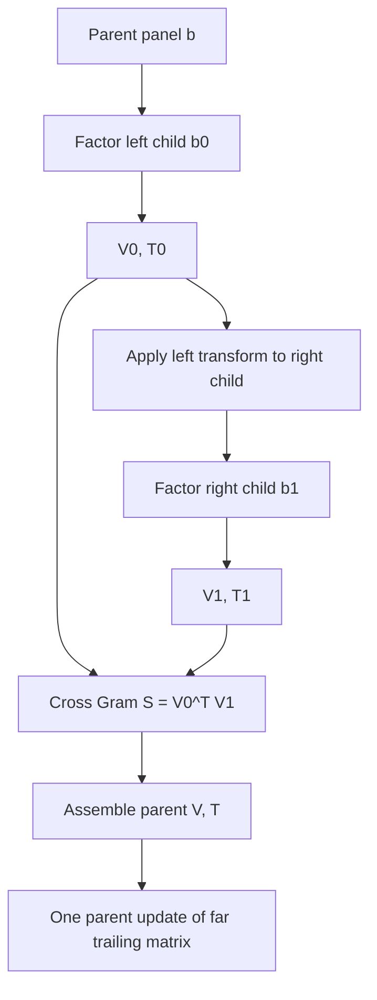
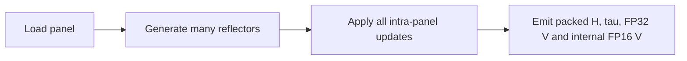
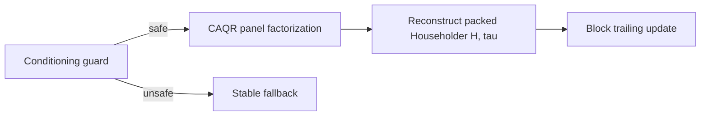
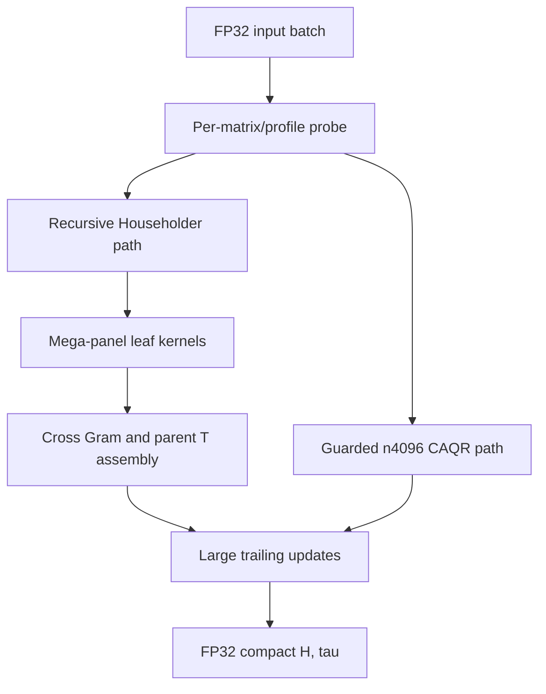

# Algorithm: Blocked and Recursive Householder QR

This document separates three layers that are easy to conflate:

1. **blocked Householder QR**, the mathematical compact-WY baseline;
2. **recursive Householder composition**, used to build larger panels from
   GPU-friendly leaves;
3. **mega-panel CUDA kernels**, which implement each leaf efficiently.

The `4096 x 4096` specialization uses a fourth component: a guarded
communication-avoiding QR path.

## 1. Blocked Householder QR

For column `i`, a Householder reflector has the form

```math
H_i = I - \tau_i v_i v_i^T.
```

A panel of width `b` produces `b` reflectors. Compact WY represents their
product as

```math
Q_p = H_0 H_1 \cdots H_{b-1} = I - V T V^T,
```

where `V = [v_0, v_1, ..., v_{b-1}]` and `T` is a small triangular matrix.
The trailing update then uses level-3 matrix operations:

```math
A_{trail} \leftarrow Q_p^T A_{trail}.
```


Blocking makes the large trailing update efficient, but reflector `i+1` still
depends on the panel update from reflector `i`.

```text
factor_panel(A, b):
    for i = 0 .. b-1:
        form (v_i, tau_i)
        update the remaining columns in the panel
    build T from all b reflectors
    apply (V, T) to the far trailing matrix
```

On a GPU, making `b` large improves the trailing GEMMs but increases the live
panel state, synchronization chain, register pressure, and shared-memory
footprint. Making `b` small causes too many launches and too little work per
launch.

## 2. Recursive Householder composition

For a panel of width `b = b0 + b1`:

1. factor the left child and obtain `(V0, T0)`;
2. apply the left transform to the right child;
3. factor the transformed right child and obtain `(V1, T1)`;
4. compute the cross term `S = V0^T V1`;
5. assemble a parent `(V, T)` and apply it once to the far trailing matrix.



For

```math
Q_0 = I - V_0 T_0 V_0^T, \qquad
Q_1 = I - V_1 T_1 V_1^T,
```

the product `Q = Q0 Q1` can be represented by

```math
V = [V_0, V_1], \qquad
T =
\begin{bmatrix}
T_0 & -T_0 (V_0^T V_1) T_1 \\
0   & T_1
\end{bmatrix}.
```

The triangular orientation may be transposed in code depending on whether the
update applies `Q` or `Q^T`; the compact-WY cross term is the same.

Recursion does not change the asymptotic QR flop count. It changes where the
work runs and how much state is live:

- sequential work is bounded inside a tuned leaf width;
- each leaf has a smaller register/shared-memory working set;
- cross-child coupling becomes matrix multiplication;
- the parent transform updates the far trailing matrix as a large block;
- leaf sizes can be selected for GPU occupancy.

The leaf width and crossover must compensate for the extra cross-Gram and
parent assembly work, so recursion is not automatically faster at every size.

## 3. Mega-panel leaf kernels

The leaf factorization uses and adapts the wide-panel CUDA kernels from
[gau.nernst's QR2 GPU MODE submission](https://www.gpumode.com/leaderboard/774?tab=rankings).

A leaf is a **mega-panel kernel** because one launch performs many logical
Householder steps:



- multiple reflectors execute inside one kernel launch;
- reflector state is reused through registers and shared memory;
- warps cooperate on small column groups inside a wide panel;
- returned compact factors remain FP32;
- FP16 `V` is internal, with FP32 accumulation and FP32 output.

The recursive hierarchy currently includes:

```text
n512:
    96  -> 48 + 48
    96  -> 48 + 48
    128 -> flat mega-panel leaf
    192 -> 96 + 96

n1024:
    192 -> 96 + 96
    both leaves write directly into the parent V allocation

n2048:
    256 -> 128 + 128
    later panels use tuned 128-column leaves
```

CUDA Graph replay packages the leaves, cross-Gram operations, parent assembly,
and trailing updates into a low-overhead schedule. Graph replay does not make
the kernels persistent.

## 4. CAQR for the largest shape

The `4096 x 4096` case has batch size two, where a scalar Householder panel
chain underutilizes the GPU. The guarded communication-avoiding route:

1. forms a small panel Gram matrix;
2. performs CholeskyQR-like panel normalization;
3. reconstructs the standard FP32 packed `(H, tau)` representation;
4. applies the block transform with level-3 operations;
5. uses hierarchical `256`, `128`, `64`, and `16` column stages.



The guard is essential because Gram/Cholesky normalization can lose accuracy
for poorly conditioned or nearly rank-deficient inputs. CAQR is selected only
for profiles that satisfy the original FP32 residual and orthogonality gates.

## 5. Comparison

| Property | Flat blocked Householder | Recursive Householder here | Guarded CAQR | Persistent kernel |
|---|---|---|---|---|
| Decomposition | One flat panel | Divide-and-compose panel tree | Communication-avoiding blocks | Any algorithm with resident workers |
| Sequential work | Across full panel | Bounded inside leaves | Reduced with block operations | Algorithm-dependent |
| GPU strength | Large trailing GEMM | Tuned leaves plus GEMM composition | High utilization at tiny batch | Avoid repeated scheduling/reloads |
| Numerical scope | General Householder | General Householder paths | Guarded safe profiles | Not a numerical method |
| Role here | Baseline | Main n512/n1024/n2048 extension | Specialized n4096 route | Not used |

A persistent kernel keeps a fixed set of CTAs resident and repeatedly pulls
matrices, panels, or tiles from a work queue. Our panel CTAs finish their
assigned panel and exit. The correct description is **recursive Householder QR
with mega-panel leaf kernels**, not persistent QR.

## 6. End-to-end execution



The mixed benchmark interleaves conditioning profiles at arbitrary batch
positions. Routing must therefore preserve correctness per matrix rather than
infer one numerical path for the whole batch from a few samples.
